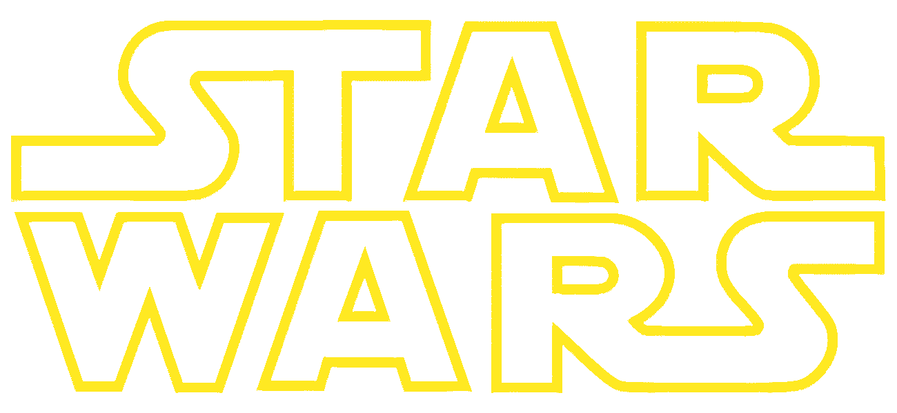
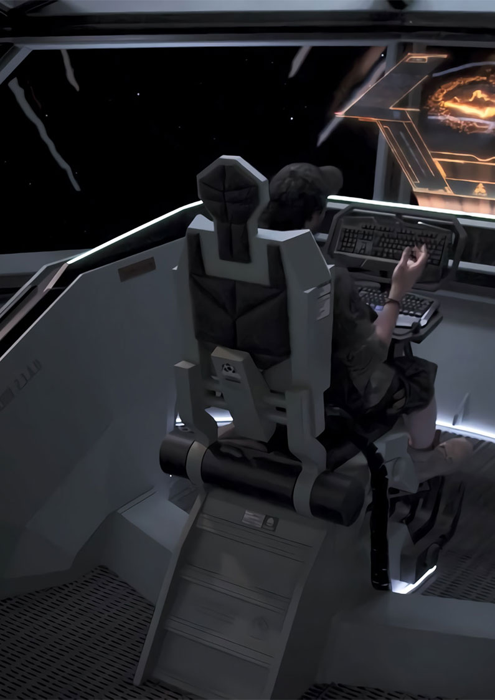

SWSE Homebrew Campaign

<!-- 
Genterated on : 12 JAN 2020 : 13:30PM : GMT+1000
 -->

\page

## A long time ago in a galaxy far, far away&hellip;

EPISODE 0  THE FATE OF THE JERICHO VII

It is 205 years after the BATTLE OF YAVIN IV, and all is not well in the GALAXY&hellip;

UNEXPLAINED ATTACKS are targeting the WILD SPACE territories, with several planets having gone dark, being cut off from the HOLONET.
	
The latest being DOSUUN, with reports from survivors saying that STARSHIPS of UNKNOWN DESIGNS have both sent in ALIEN TROOPS to defeat the defenders of these worlds, then proceeding to turn the surfaces of these worlds to a form of glass.

On a shakedown run to the planet of MARAT V aboard the JERICHO VII, both it and its CREW come under attack by these UNKOWN ADVERSARIES. The CREW are ordered to jettison its CARGO, then abandon ship. YOU are part of this CREW&hellip;

\page

# Campaign House Rules

___

Players are to abide by the following campaign house rules when creating their characters in this campaign.

 

### Default:

* The [2008 Errata](http://holocast.terceiraterra.com/wp-content/uploads/2011/10/SW_errata_A4_Out2008.pdf) will be in effect.
* 28 point buy (Slightly higher than default)
* May **NOT** have Non-Heroic classes
* At Campaign start, Characters begin at 3rd level, with the Wealth according to the below table.
* Instead of using Destiny Points (DP), I'll be using Backgrounds. Information on these can be found in the ***Rebellion Era Campaign Guide***, on pages 16&mdash;22.

### Species:

* Species given a “PC write-up” may be selected as PC races but I may restrict species based on campaign setting.  Other species including those with a NPC write-up may be selected with my approval.
* Yuuzhan Vong do receive Force Points equal to 3 + &frac12; heroic level each time they level in a heroic class.  They however may NOT take Force Sensitivity and are restricted like droids when it comes to how they can spend those points. Reason: the Vong Force Immunity in no way makes up for this lack of a vital game resource.

### Classes:

* Jedi have 4 + INT modifer.
* If going for a specific theme of class (Variant Force traditions, etc), see next section.

 

#### The following Class Traits can be substituted as followed:

* Lightsaber may be replaced with Advanced Melee Weapons, Martial Arts I, or an Exotic weapon subject to GM approval.
* Rifles may be replaced with Advanced Melee Weapons.
* Rifles plus Pistols may be replaced with Lightsaber; the Lightsaber may then be exchanged as above.
* Rifles plus Armor (Lights & Medium) may be replaced with Martial Arts I.

### Skills:

* Use Computer:  Astrogate &ndash; This aspect of the skill may be used untrained by a ships system operator/pilot who is using a Navicomputer.

### Feats:

* Dodge: Instead of designating a single opponent you may designate either a single opponent, all ranged attacks, or all melee attacks against which you gain the +1 Reflex Defense.  You make this designation as a free action on your turn.  Reason:  Add functionality to the feat.
* Linguist:  Change prerequisite to INT 11.

### Combat:

* Diagonal Movement:  Counts as one square of movement.

### Player Specific Rules:

* Richard, at any point, is **NOT** allowed to munchkin the game. If he does so, he will harshly penalised. This includes via proxy.

### Banned Content

* Any *Tech Specialist* related items are banned.

## Wealth by Level for Characters after 1st level

<!---
Character Level | Starting Credits | w/ Wealth Talent
|:---:|:-----------:|:-----------:
1 | Max Class Credit Roll | Max Class Credit Roll + Wealth
2 | 4,000 | 8,000
3 | 12,000 | 24,000
4 | 24,000 | 48,000
5 | 40,000 | 80,000
6 | 60,000 | 120,000
7 | 84,000 | 168,000
8 | 112,000 | 224,000
9 | 144,000 | 288,000
10 | 180,000 | 360,000

 

Character Level | Starting Credits | w/ Wealth Talent
|:---:|:-----------:|:-----------:
11 | 220,000 | 440,000
12 | 264,000 | 528,000
13 | 312,000 | 624,000
14 | 364,000 | 728,000
15 | 420,000 | 840,000
16 | 480,000 | 960,000
17 | 544,000 | 1,088,000
18 | 612,000 | 1,224,000
19 | 684,000 | 1,368,000
20 | 760,000 | 1,520,000
-->

| Character Level | Starting Credits | w/ Wealth Talent | Character Level | Starting Credits | w/ Wealth Talent |
|:---:|:-----------:|:-----------:|:---:|:-----------:|:-----------:|
| 1 | Max Class Credit Roll | Max Class Credit Roll + Wealth | 11 | 220,000 | 440,000 |
| 2 | 4,000 | 8,000 | 12 | 264,000 | 528,000 |
| 3 | 12,000 | 24,000 | 13 | 312,000 | 624,000 |
| 4 | 24,000 | 48,000 | 14 | 364,000 | 728,000 |
| 5 | 40,000 | 80,000 | 15 | 420,000 | 840,000 |
| 6 | 60,000 | 120,000 | 16 | 480,000 | 960,000 |
| 7 | 84,000 | 168,000 | 17 | 544,000 | 1,088,000 |
| 8 | 112,000 | 224,000 | 18 | 612,000 | 1,224,000 |
| 9 | 144,000 | 288,000 | 19 | 684,000 | 1,368,000 |
| 10 | 180,000 | 360,000 | 20 | 760,000 | 1,520,000 |

\page

## Prepare to enter Hyperspace&hellip;

With a Session 0 & 1 Soundtrack playlist containing AC/DC, DragonForce, and a player piano Cantina Theme, players should find themselves rocking out with their sabers out.

### A Campaign by RJBPrime

### Featuring: Mayhem, Wonder, and 

### Gratuitous Explosions

